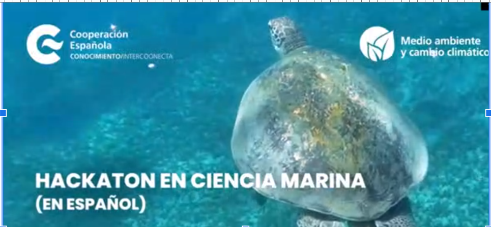

      
    </td>
    <td align="right">
      

##  Proyecto 1 — Variabilidad espacio-temporal de las capturas de atún (1990-2023)

💡💻 **Hackatón OceanHackWeek en Español — OHWe 2024**

### 👥 Autores
- **Elmer Quispe-Salazar**
- **Malurisbel López Campos**
- **José Fco. Chávez**
- **Alejandro Gallardo**
- **Esther Cabral**

🔗 Puedes revisar en proyecto [aquí](https://github.com/Intercoonecta/ohwe24-proy1-pesca/blob/main/proyect/run_TunaSetType_repo.md)

---

## 📝 Descripción del proyecto
En este proyecto analizamos cómo varían las capturas de atún en el OPO entre 1990 y 2023, integrando:  
- Especie objetivo (BET, SKJ, YFT). :contentReference[oaicite:1]{index=1}  
- Tipo de lance (DEL, NOA, OBJ). :contentReference[oaicite:2]{index=2}  
- Esfuerzo de pesca (número de lances).  
- Información espacio–temporal (cuadrículas 1°×1°, año, mes).  
- Variables ambientales (TSM, clorofila) de productos CMEMS. :contentReference[oaicite:3]{index=3}  

Buscamos describir patrones de distribución, cambios en áreas de pesca y asociaciones con el ambiente y las estrategias operativas de la flota cerquera.

---

## 📜 Licencia
Este proyecto se publica con fines académicos dentro de OHWe 2024, y se publica bajo una licencia abierta (MIT), lo que permite su uso, modificación y redistribución con fines académicos, científicos y de desarrollo, siempre y cuando se mantenga el reconocimiento a los autores originales.
Copyright (c) 2024 — Autores del proyecto 📂

